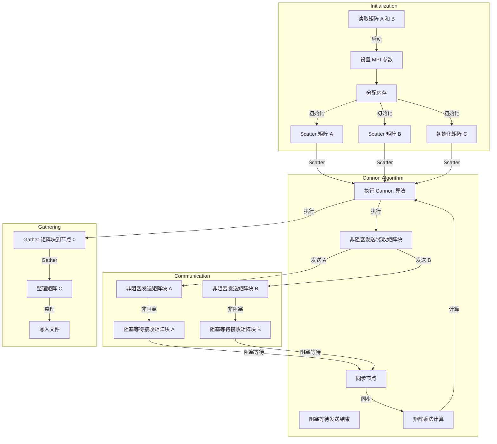

```mermaid
graph TD
  subgraph Initialization
    A[读取矩阵 A 和 B]
    B[设置 MPI 参数]
    C[分配内存]
    D[Scatter 矩阵 A]
    E[Scatter 矩阵 B]
    F[初始化矩阵 C]
  end

  subgraph Cannon Algorithm
    G[执行 Cannon 算法]
    H[非阻塞发送/接收矩阵块]
    I[阻塞等待发送结束]
    J[同步节点]
    K[矩阵乘法计算]
  end

  subgraph Communication
    L[非阻塞发送矩阵块 A]
    M[非阻塞发送矩阵块 B]
    N[阻塞等待接收矩阵块 A]
    O[阻塞等待接收矩阵块 B]
  end

  subgraph Gathering
    P[Gather 矩阵块到节点 0]
    Q[整理矩阵 C]
    R[写入文件]
  end

  A -->|启动| B
  B --> C
  C -->|初始化| D
  C -->|初始化| E
  C -->|初始化| F

  D -->|Scatter| G
  E -->|Scatter| G
  F -->|Scatter| G

  G -->|执行| H
  H -->|发送 A| L
  H -->|发送 B| M
  L -->|非阻塞| N
  M -->|非阻塞| O
  N -->|阻塞等待| J
  O -->|阻塞等待| J
  J -->|同步| K
  K -->|计算| G

  G -->|执行| P
  P -->|Gather| Q
  Q -->|整理| R
```

